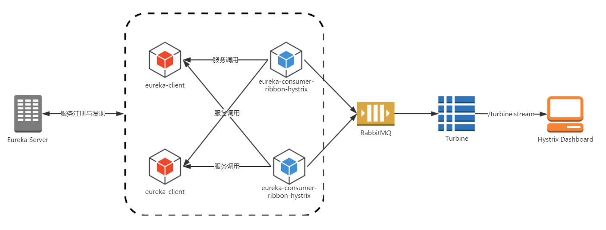

# hystrix-turbine-dashboard
centralized hystrix dashboard - using turbine stream

 - Hystrix dashboard  
   
 
 - Hystrix dashboard - centralized - using turbine  
   
 
 - Hystrix dashboard - centralized - using turbine + stream(rabbitmq)  
   

# Bug:

```
<springboot.version>2.1.6.RELEASE</springboot.version>
<springcloud.version>Greenwich.SR1</springcloud.version>

or

<springboot.version>2.1.5.RELEASE</springboot.version>
<springcloud.version>Greenwich.RELEASE</springcloud.version>
```

Have to remove spring-boot-starter-actuator from pom.xml, otherwise, cannot register turbine.stream.destination: hystrixStreamOutput and no data displayed on hystrix dashboard

_refer to http://blog.didispace.com/spring-cloud-starter-dalston-5-2_